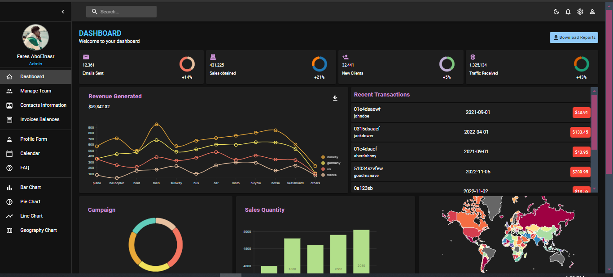

# Admin Dashboard

A high-performance admin dashboard developed with React and Vite, featuring a modern and responsive interface. The dashboard provides efficient data management and visualization capabilities, making it ideal for managing complex data sets with ease.

### Number of pages: 11 pages


## Live Demo

[View Live Demo](admin-dashboardd-tau.vercel.app)

## Features

- **User Interface**: Designed with Material UI for a sleek, intuitive, and responsive user experience.
- **Navigation**: Implemented React Router DOM for smooth and easy navigation across different sections.
- **Form Validation**: Integrated React Hook Form for robust form validation and user input management.
- **Calendar Management**: Used FullCalendar for effective scheduling and event management.
- **Data Visualization**: Created interactive and visually appealing charts and graphs using Nivo.
- **Performance**: Leveraged Vite for fast development and optimized build performance.

## Technologies Used

- **Frontend**: React.js, Vite
- **UI Components**: Material UI
- **Routing**: React Router DOM
- **Form Validation**: React Hook Form
- **Calendar**: FullCalendar
- **Data Visualization**: Nivo for charts and graphs

## Installation

1. **Clone the repository:**

   ```bash
   git clone https://github.com/aboelnasrvip/Admin_Dashboardd.git
   cd Admin_Dashboardd


2. **Install dependencies:**
   ```bash
   npm install

3. **Run the application:**
   ```bash
   npm run dev


